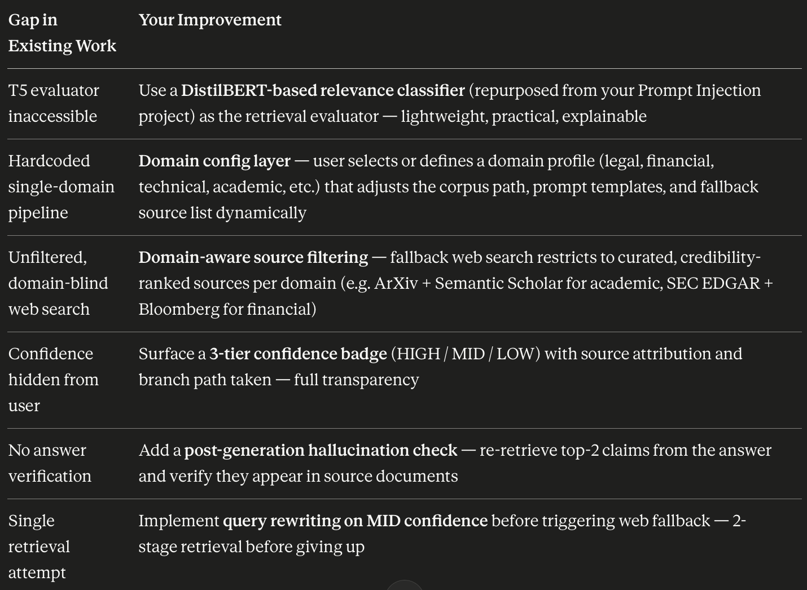
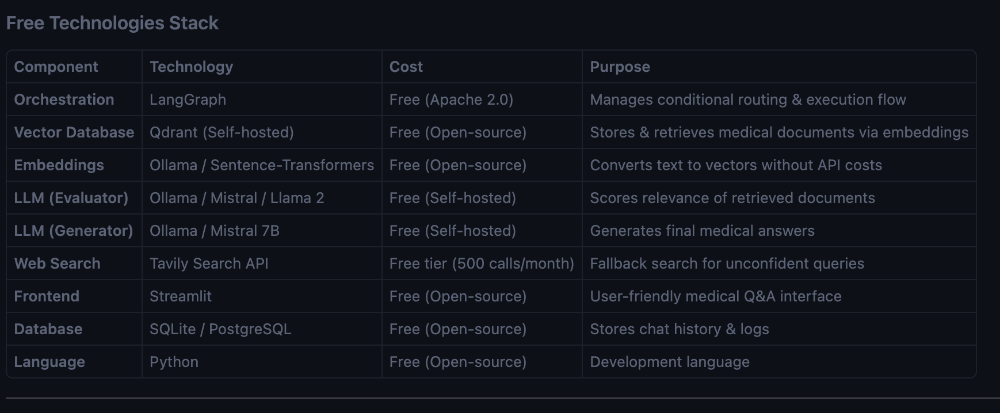

1. The Original Paper
The original CRAG paper (Yan et al., arXiv:2401.15884, 2024) proposes a lightweight retrieval evaluator that assesses the overall quality of retrieved documents, returning a confidence degree to trigger different knowledge retrieval actions. It also uses large-scale web searches as an extension when the local corpus fails, and introduces a decompose-then-recompose algorithm for selectively focusing on key information from retrieved documents.

2. GitHub Implementations That Already Exist
The most common existing implementation (Kirouane-Ayoub/Corrective-RAG) uses LangGraph for control flow, LangChain for LLM interaction, and Streamlit for UI. It covers document retrieval, grading, query transformation, web search fallback, and final answer generation.
Other implementations on GitHub use FAISS/Gemini/DuckDuckGo combinations, with one using the langgraph-builder — but almost all follow the same vanilla pipeline.
So to be blunt: a generic CRAG + LangGraph + Streamlit project already exists on GitHub and won't move your resume needle. You need to differentiate.

❌ Drawbacks of Existing CRAG Implementations
1. Evaluator is a Fine-tuned T5 — Not Practical for Students
The original paper uses T5-large (0.77B parameters) fine-tuned as the retrieval evaluator — requiring labeled training data and compute that is inaccessible for most practitioners. Every GitHub project sidesteps this by just using an LLM prompt as the grader — which is less rigorous and adds latency.
2. Hardcoded Generic Pipelines — Zero Domain Configurability
All existing implementations are rigid, single-purpose document Q&A chatbots. They are hardcoded to one document corpus with no ability to switch domains, configure source preferences, or adapt prompting to different knowledge contexts. A user cannot point the system at a legal corpus one day and a technical documentation corpus the next — the pipeline has to be manually rewired every time. Industry benchmarks show that state-of-the-art RAG solutions only answer 63% of questions without hallucination, and this failure rate worsens significantly when the retrieval corpus doesn't match the query domain — a problem that no existing CRAG implementation attempts to solve structurally.
3. Binary/Trivial Fallback — Web Search is Unfiltered and Domain-Blind
Existing projects fall back to a generic Tavily/DuckDuckGo web search with no awareness of what domain the user is working in. There is no source credibility filtering — a Wikipedia page and a random blog post are treated equally regardless of whether the corpus is legal, financial, technical, or scientific. The fallback is completely decoupled from the domain context of the rest of the pipeline.
4. No Confidence Score Surfaced to the User
CRAG assigns confidence categories (Correct, Incorrect, Ambiguous) internally, but existing implementations never expose this to the user — the user gets an answer with no idea how confident the system is or whether it fell back to web search.
5. No Answer Verification Loop
Recent extensions of CRAG point toward Chain-of-Verification RAG: after standard answer generation, a verification module checks the output — but almost no student project implements this post-generation verification step.
6. Single-Stage Retrieval Only
Active retrieval research shows systems should dynamically refine or re-issue queries if initially retrieved content is insufficient — but most CRAG implementations issue only one retrieval attempt before triggering the fallback.

✅ How my project overcomes these drawbacks 

Techstack (free) :
